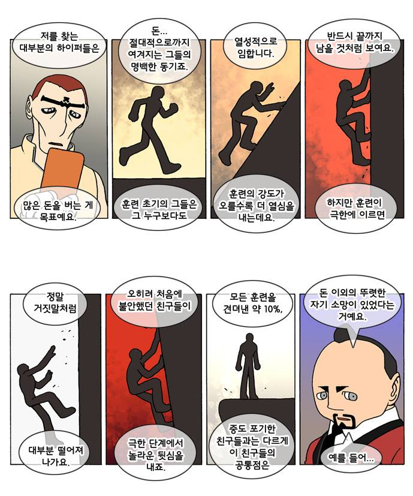
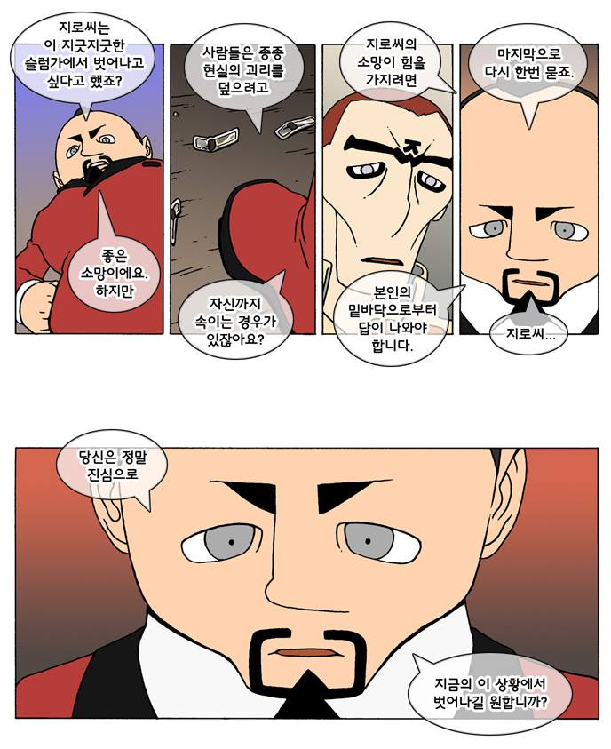
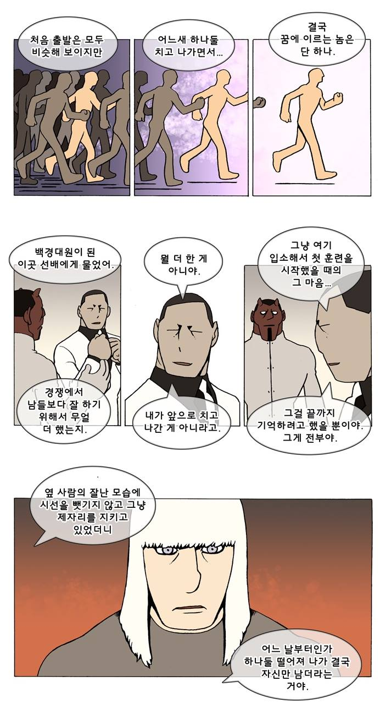

# 대학원 시절.
3년 전에도 보고 있고 지금도 꾸준히 보는 웹툰 중에 덴마라는 웹툰이 있다. 3년 전 이상하게 만화를 보고 힘이
나는 장면이 있었는데 이 장면을 저장해서 노트북 바탕화면에 넣고 2년 동안  꾸준히 봤었다.




덴마 2-242화 중에서



```
  # 당신은 정말 진심으로 지금의 이 상황에서 벗어나길 원합니까?
```

나는 진심으로 무엇을 하고 싶고, 이 상황에서 어떻게 하고 싶은 것인지 매일 아침 되물었던 것으로 기억한다.
3년이 지난 지금에도 이 웹툰에서는 그때의 동일인물이 나온 에피소드가 나에게 위로를 줬다.



3년 전, 이 캐릭터는 웹툰 상에서 마약중독자로서 살아가고 있는 와중에 최고의 코치를 만났었다. 그때 그 코치의 말대로 살아왔고, 자신의 행복했던 시절로 다시 돌아가고 싶다는 일념 하나만으로 마약을 끊었다.
만화에서 3년이 지난 그는 약을 끊고, 완전한 정상인이 되어 새로운 조언을 듣고 있는 장면이 나왔다.

```
# 뭘 더 한 게 아니야. 그냥 여기 입소해서 첫 훈련을 시작했을 때의 그 마음...  그걸 끝까지 기억하려고 했을 뿐이야. 그게 전부야.
```

재미있는 건, 만화 속에서도 3년이 흘렀고, 나의 시간도 3년이 흘렀다. 3년 전 나도 내가 벗어나고 싶은 상황에서는 벗어났고, 그럭저럭 잘 살아가고 있다. 애초에 만화의 주인공(지로는 주인공이 아니지만. 덴마.)과 같이 최악의 상황도 아니었지만.

요즘 지내다 보면, 주위에 왜 이리 잘나고 잘하는 사람들로 가득 차 있는지. 세상은 넓고 인재는 많다지만, 심리가 그렇다. 내 아쉬움이 더 커 보이고, 내 부족함이 더 커 보인다. 남들은 순탄하게 삶을 살아가는 것처럼만 보이고, 대학원 시절에 있을 땐, 내가 데이터 수집에 끙끙대고 있는 순간에, 어딘가에서 끝도 없이 나오는 엄청난 논문들과 연구결과들에 한숨만 나왔었고, 개발자로 일하는 동안에는 내가 작은 버그에 고통스러워하는 순간에도, 누군가는 멋진 프로젝트를 오픈소스로 내놓았다던가, 누군가는 새롭게 앱을 만들어서 대박이 났다던가,

뭐, 그런

것이었다. 사실 나는 내가 가진 능력보다 항상 더 많은 것들이 주어졌음에도 감사함이 부족했다. 다른 사람들의 성과나 다른 사람들이 가진 것들을 부러워하기보다는,

앞의 1~2년 동안, 내가 처음 일을 시작했을 때의 마음가짐. 지금 이곳에 들어올 때의 마음가짐을 잊지 않고 끝까지 놓지 않기를. 더 잘할 필요도, 더 많은 것을 원하거나 꿈꿀 필요도 없다. 처음의 마음가짐대로 살아가고, 그만큼 성장하는 것이 내가 추구해야 할 방향이다

- 생각하다, 덴마, 웹툰
